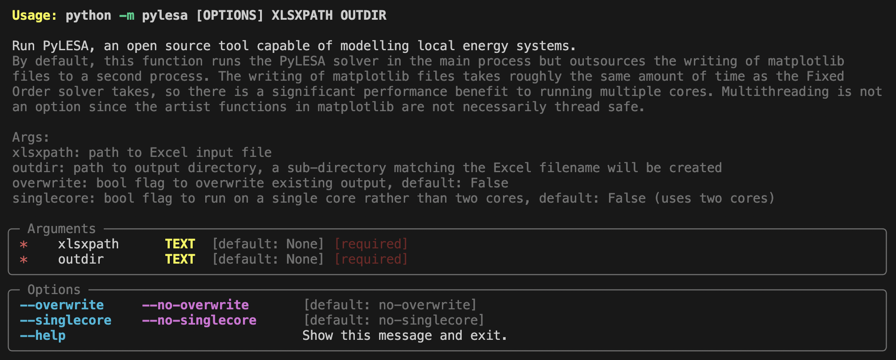

# `PyLESA`
`PyLESA` stands for Python for Local Energy Systems Analysis and is pronounced "pai-lee-suh".

`PyLESA` is an open source tool capable of modelling local energy systems containing both electrical and thermal technologies. It was developed with the aim of aiding the design of local energy systems. The focus of the tool is on modelling systems with heat pumps and thermal storage alongside time-of-use electricity tariffs and predictive control strategies. It is anticipated that the tool provides a framework for future development including electrical battery studies and participation in grid balancing mechanisms.

This tool was developed as part of a PhD, "Modelling and Design of Local Energy Systems Incorporating Heat Pumps, Thermal Storage, Future  Tariffs, and Model Predictive Control" by Andrew Lyden.

## Usage

1. Install [Python 3.10](https://www.python.org/downloads/) and [Git](https://git-scm.com/).

2. Clone this git repo onto your machine:
```
git clone git@github.com:andrewlyden/PyLESA.git
```

3. Install the `PyLESA` python virtual environment:
```
python3.10 -m venv venv
source venv/bin/activate
python -m pip install --upgrade pip
python -m pip install -r requirements.txt
```

4. Define and gather data on the local energy system to be modelled including resources, demands, supply, storage, grid connection, and control strategy. Define the increments and ranges to be modelled within the required parametric design. Input all this data using one of the template Excel Workbooks from the [inputs](./inputs) folder.

5. Optionally run the demand ([heat_demand.py](./pylesa/demand/heat_demand.py) and [electricity_demand.py](./pylesa/demand/electricity_demand.py)) and resource assessment methods (see PhD thesis for details) to generate hourly profiles depending on available data. Input generated profiles into the Excel Workbook.

6. Using a terminal (e.g. PowerShell) within the clone of the `PyLESA` git repo, run:

    ```python
    source venv/bin/activate
    python -m pylesa --help # to display help messages
    python -m pylesa ./inputs/{name of Excel input file}.xlsx my/existing/output/directory --overwrite
    ```
    Running `python -m pylesa --help` will display the following help message:
    

    Note that PyLESA defaults to using 2 compute cores: 1 to run the solver, 1 to generate matplotlib
    figures and write them to disc. Using the `--singlecore` command-line option will force PyLESA
    to run on a single core which will increase the overall runtime.

7. After the run is complete, open the outpus folder in your chosen run directory to view the KPI 3D plots and/or operational graphs, as well as .csv outputs (note that an error will be raised if only one simulation combination is run, as 3D plots cannot be processed). There are also raw outputs.pkl files for each simulation combination which contains a vast range of raw outputs.

    Information about the run is written to a `pylesa.log` file located in the output folder. This
    file contains details of run progress and any warning or error messages that may have occurred. E.g.:

    ```python
    2024-06-10 09:13:35,749: INFO: Reading MS Excel file: performance_test.xlsx
    2024-06-10 09:13:41,651: INFO: Completed reading MS Excel file: performance_test.xlsx
    2024-06-10 09:13:41,693: INFO: Input complete. Time taken: 6 seconds
    2024-06-10 09:13:41,693: INFO: Running 4 combinations of heat pump power / storage size
    2024-06-10 09:13:55,635: INFO: Ran fixed order controller: hp_1000_ts_500000. Time taken: 14 seconds
    2024-06-10 09:14:01,983: INFO: Written output files for: hp_1000_ts_500000. Time taken: 6 seconds
    2024-06-10 09:14:09,506: INFO: Ran fixed order controller: hp_1000_ts_1000000. Time taken: 14 seconds
    2024-06-10 09:14:16,391: INFO: Written output files for: hp_1000_ts_1000000. Time taken: 7 seconds
    2024-06-10 09:14:24,403: INFO: Ran fixed order controller: hp_2000_ts_500000. Time taken: 15 seconds
    2024-06-10 09:14:31,716: INFO: Written output files for: hp_2000_ts_500000. Time taken: 7 seconds
    2024-06-10 09:14:39,682: INFO: Ran fixed order controller: hp_2000_ts_1000000. Time taken: 15 seconds
    2024-06-10 09:14:45,924: INFO: Written output files for: hp_2000_ts_1000000. Time taken: 6 seconds
    2024-06-10 09:14:48,969: INFO: Wrote KPIs. Time taken: 3 seconds
    2024-06-10 09:14:48,969: INFO: Simulations and outputs complete. Time taken: 1.12 minutes
    2024-06-10 09:14:48,969: INFO: Run complete. Time taken: 1.22 minutes
    ```

A video discussing how to run `PyLESA` is available here: https://youtu.be/QsJut9ftCT4

## Testing
The `PyLESA` source code is tested using [pytest](https://docs.pytest.org/en/8.2.x/). The tests can be run locally by running the following command:

```python
source venv/bin/activate
python -m pytest -svv
# for test coverage reporting run:
python -m pytest --cov=pylesa -svv --cov-report term-missing
```

## References

PhD Thesis - Modelling and design of local energy systems incorporating heat pumps, thermal storage, future tariffs, and model predictive control (https://doi.org/10.48730/8nz5-xb46)

SoftwareX paper - `PyLESA`: A Python modelling tool for planning-level Local, integrated, and smart Energy Systems Analysis (https://doi.org/10.1016/j.softx.2021.100699)

Energy paper - Planning level sizing of heat pumps and hot water tanks incorporating model predictive control and future electricity tariffs (https://doi.org/10.1016/j.energy.2021.121731)
